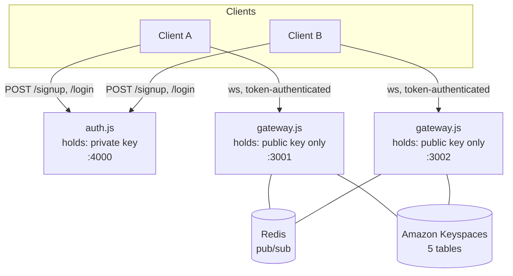

# simple-chat

A WebSocket chat backend built as a system design learning project — 1:1 messaging, small-group messaging, and token-based auth, backed by Redis pub/sub for live delivery and Amazon Keyspaces (Cassandra) for durable storage.

Full architecture writeup with diagrams: [docs/architecture.html](docs/architecture.html).

## Features

- **1:1 and group messaging** over WebSockets, with live delivery and offline catch-up
- **Durable storage** in Amazon Keyspaces, sharded two different ways for two different query patterns (see the architecture doc)
- **Multiple interchangeable gateway processes** sharing one Redis broker and one database — no gateway-local state
- **Token-based auth**: real accounts (Argon2id-hashed passwords), RS256-signed JWTs issued by a standalone auth service that's the only thing holding the private key
- **Built to fail safely**: durable writes always happen before best-effort delivery, per-connection errors are isolated so one bad connection can't take down a whole gateway, and every non-obvious design decision is documented with the failure mode it avoids

## Architecture, briefly



`auth.js` and `gateway.js` never talk to each other directly — the only thing they share is the public half of a key pair generated once at setup. Every gateway is otherwise identical and stateless; Redis and Keyspaces are the only shared state.

For the full picture — why messages are stored in two tables sharded differently, why writes happen in a specific order, and a running list of decisions that weren't the obvious default — see [docs/architecture.html](docs/architecture.html).

## Project structure

```
server/
  auth.js              standalone auth service — signup/login, owns the private key
  gateway.js            WebSocket gateway — verifies tokens, routes messages
  db.js                 Cassandra/Keyspaces access layer
  docker-compose.yml     Redis, for local pub/sub
  keys/                  RS256 key pair (gitignored — private.pem is a real secret)
  keyspaces/              table schema definitions (JSON, used with the AWS CLI)
  .env                   Keyspaces credentials (gitignored)
client/
  client.js              interactive CLI chat client
docs/
  architecture.html       detailed architecture writeup with diagrams
```

## Setup

### 1. Provision Amazon Keyspaces

Requires an AWS account and the AWS CLI configured. Create a keyspace named `chat_learning` and the five tables described in `server/keyspaces/*.schema.json`:

```bash
aws keyspaces create-keyspace --keyspace-name chat_learning --region <your-region>

# for each *.schema.json in server/keyspaces/:
aws keyspaces create-table \
  --keyspace-name chat_learning \
  --table-name <name-matching-the-file> \
  --schema-definition file://server/keyspaces/<file>.schema.json \
  --capacity-specification throughputMode=PAY_PER_REQUEST \
  --region <your-region>
```

Generate a service-specific credential for Keyspaces (username/password the driver will authenticate with):

```bash
aws iam create-service-specific-credential \
  --user-name <an-iam-user-scoped-to-keyspaces> \
  --service-name cassandra.amazonaws.com
```

Download the TLS trust bundle Keyspaces requires and combine it into one file at `server/keyspaces/keyspaces-bundle.pem`:

```bash
cd server/keyspaces
curl -O https://www.amazontrust.com/repository/AmazonRootCA1.pem
curl -O https://www.amazontrust.com/repository/AmazonRootCA2.pem
curl -O https://www.amazontrust.com/repository/AmazonRootCA3.pem
curl -O https://www.amazontrust.com/repository/AmazonRootCA4.pem
curl -O https://certs.secureserver.net/repository/sf-class2-root.crt
cat AmazonRootCA1.pem AmazonRootCA2.pem AmazonRootCA3.pem AmazonRootCA4.pem sf-class2-root.crt > keyspaces-bundle.pem
```

### 2. Generate the JWT signing key pair

```bash
mkdir -p server/keys
openssl genrsa -out server/keys/private.pem 2048
openssl rsa -in server/keys/private.pem -pubout -out server/keys/public.pem
```

`private.pem` is a real secret — it's gitignored, and only `auth.js` ever reads it.

### 3. Configure `server/.env`

```
KEYSPACES_USERNAME=<from the service-specific credential>
KEYSPACES_PASSWORD=<from the service-specific credential>
KEYSPACES_ENDPOINT=cassandra.<your-region>.amazonaws.com
AWS_REGION=<your-region>
```

### 4. Install dependencies

```bash
npm install
```

## Running it

Start Redis:

```bash
cd server && docker compose up -d
```

Start the auth service and one or more gateways, each in its own terminal:

```bash
npm run auth
npm run gateway -- 3001 gateway-1
npm run gateway -- 3002 gateway-2
```

Connect with the CLI client (`--signup` creates the account first):

```bash
npm run client -- alice hunter2 3001 --signup
npm run client -- bob hunter2 3002 --signup
```

Once connected:

| Type this | To |
|---|---|
| `bob:hey there` | send a 1:1 message to user `bob` |
| `/creategroup Trip alice,bob,carol` | create a group (you're added automatically; needs 3+ members total) |
| `#<groupId>:hey everyone` | send to a group by id (printed when the group is created) |

Kill a gateway mid-session and watch the connected client automatically reconnect and catch up on whatever it missed — that behavior, and the design decisions behind it, are covered in [docs/architecture.html](docs/architecture.html).
